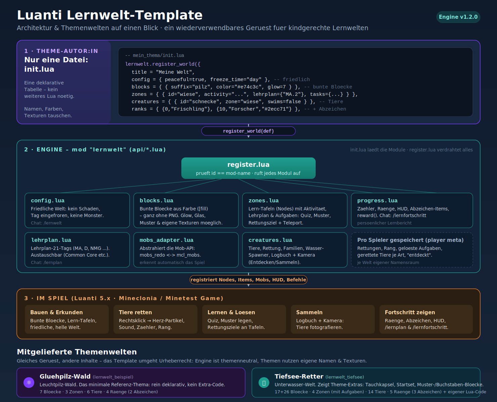
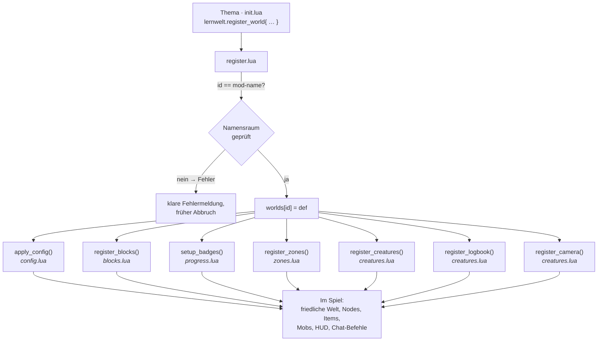
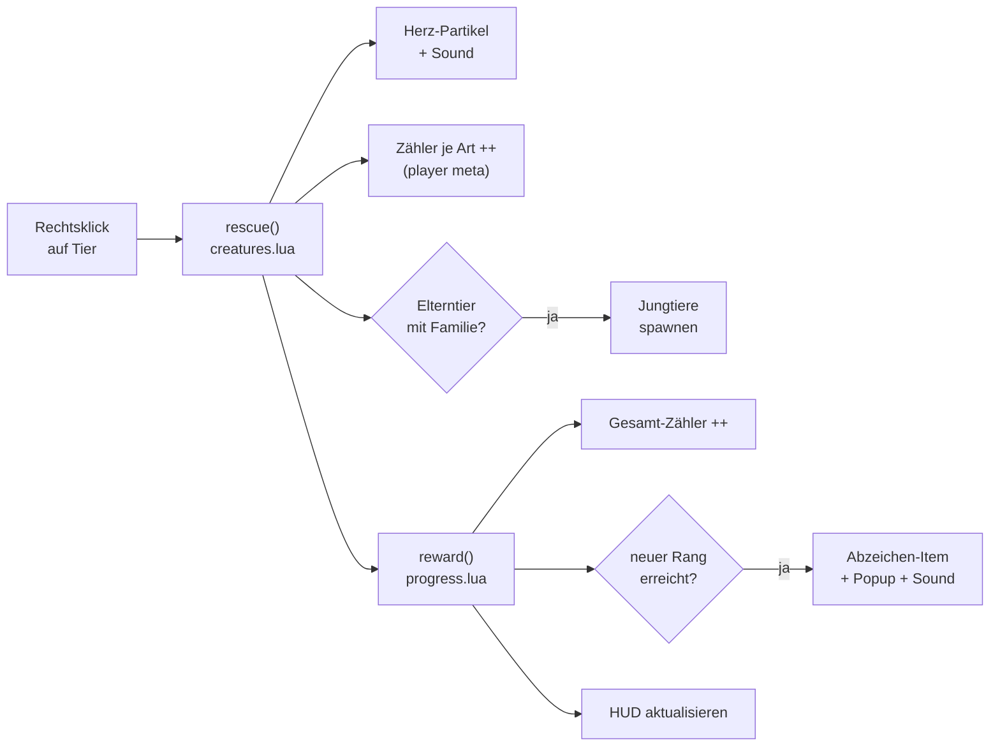
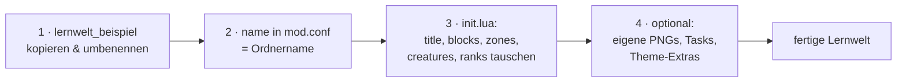

# Architektur & Themenwelten – Visualisierung

> Diese Seite erklärt **auf einen Blick**, wie das Lernwelt-Template aufgebaut
> ist und wie die mitgelieferten Themenwelten darauf aufsetzen. Gedacht für
> interessierte Entwickler:innen, die Aufbau und Mechanik schnell verstehen
> wollen.
>
> 🇬🇧 The codebase comments and the [README](../README.md) are in English; this
> visual guide is in German to match the example themes.

---

## Das große Bild

Drei Schichten: Die **Theme-Autor:in** schreibt nur eine deklarative Tabelle,
die **Engine** verdrahtet daraus alle Mechaniken, und im **Spiel** entstehen
Blöcke, Tiere, Tafeln und Fortschritt.



---

## Kernidee in einem Satz

Ein Thema ist **ein einziger `register_world{...}`-Aufruf** – kein weiteres Lua
nötig. Die Engine (`lernwelt`) liefert sämtliche Mechanik; Themen liefern nur
Namen, Farben, Zonen, Tiere und Lehrplan-Tags. Dadurch sind Themen
austauschbar, und Urheberrecht ist kein Thema: Die Engine ist themenneutral,
jedes Thema nutzt eigene Namen und Texturen.

```lua
lernwelt.register_world({
    title     = "Meine Welt",
    config    = { peaceful = true, freeze_time = "day" },
    blocks    = { { suffix = "pilz", color = "#e74c3c", glow = 7 } },
    zones     = { { id = "wiese", activity = "...", lehrplan = { "MA.2" }, tasks = { … } } },
    creatures = { { id = "schnecke", zone = "wiese" } },
    ranks     = { { 0, "Frischling" }, { 10, "Forscher", "#2ecc71" } },
    logbook   = { title = "Forscher-Logbuch" },
})
```

---

## Wie ein Thema geladen wird

`init.lua` der Engine lädt die Module in fester Reihenfolge; danach ruft jedes
Thema `register_world` auf, das wiederum jedes Modul verdrahtet.



---

## Die Module der Engine

| Modul | Aufgabe | Sichtbar im Spiel |
|---|---|---|
| `config.lua` | Friedliche Welt: kein Schaden, Tag eingefroren, keine Monster; sammelt empfohlene `minetest.conf`-Zeilen | `/lernwelt` |
| `lehrplan.lua` | Lehrplan-21-Tags (MA, D, NMG …); austauschbar gegen andere Curricula | `/lernplan` |
| `blocks.lua` | Bunte Blöcke aus Farbe (`[fill`) – ohne PNG; Glow, Glas, Muster, eigene Texturen | platzierbare Blöcke |
| `progress.lua` | Zähler, Ränge, HUD, Abzeichen-Items, zentrales `reward()` | HUD, `/lernfortschritt` |
| `mobs_adapter.lua` | Abstrahiert `mobs_redo` ↔ `mcl_mobs`; erkennt das Spiel automatisch | – (intern) |
| `creatures.lua` | Tiere, Rettung, Familien, Wasser-Spawner, Logbuch & Kamera | Tiere, Logbuch, Kamera |
| `zones.lua` | Lern-Tafeln (Nodes) mit Aktivität, Lehrplan und Aufgaben (Quiz/Muster/Rettung) + Teleport | Lern-Tafeln |
| `register.lua` | Der einzige Einstieg: prüft `id`, speichert die Welt und ruft alle Module auf | – (Orchestrierung) |

Lade-Reihenfolge (aus `init.lua`): `lehrplan → config → blocks → progress →
mobs_adapter → creatures → zones → register`. Reihenfolge zählt, weil
`register.lua` alle anderen Module benutzt.

---

## Die zentrale Schleife: Retten → Belohnen

Das Herz der Mechanik. Ein Rechtsklick auf ein Tier ruft `lernwelt.rescue` auf;
die Belohnung (`lernwelt.reward`) ist wiederverwendbar und wird auch von
gelösten Tafel-Aufgaben genutzt.



Dieselbe `reward()`-Funktion belohnt auch gelöste Aufgaben an den Lern-Tafeln
(Quiz, Muster, Rettungsziel) – siehe `zones.lua`.

---

## Was pro Spieler gespeichert wird

Aller Fortschritt liegt im **`player meta`**, je Welt in einem eigenen
Schlüssel-Namensraum (`lernwelt:<welt-id>:…`), sodass mehrere Welten parallel
ohne Konflikt funktionieren:

- `…:rescues` – Gesamtzahl geretteter Tiere (→ Rang, HUD)
- `…:rank` – aktuell erreichter Rang
- `…:c_<tier>` – Rettungen je Tierart (Logbuch)
- `…:seen_<tier>` – mit der Kamera „entdeckt" (Sammel-Loop)
- `…:tasks` – Anzahl gelöster Tafel-Aufgaben
- `…:task:<zone>:<n>` – einzelne Aufgabe gelöst (einmalig)

---

## Die Themenwelten

Die Themen nutzen dasselbe Gerüst, zeigen aber verschiedene Stufen – von der
minimalen Kopiervorlage bis zum voll ausgebauten Thema mit eigenem Extra-Code:

### 🍄 Gluehpilz-Wald (Vorlage) · `lernwelt_beispiel`

Das **minimale Referenz-Thema** – rein deklarativ, ohne jeglichen Extra-Code.
Die ideale Kopiervorlage für eine eigene Welt.

| | |
|---|---|
| Blöcke | 7 (Leuchtpilze in 5 Farben, Waldweg, Glas) |
| Zonen | 3 (Pilzdorf, Glüh-Höhle, Bach-Wiese) |
| Tiere | 6 (Schnecke, Marienkäfer, Glühkäfer, Fledermaus, Igel, Molch) |
| Ränge | 4 (davon 2 mit Abzeichen) |
| Besonderheit | rein deklarativ; Legacy-Aliase nach Umbenennung |

### 🍄 Gluehpilz-Wald (voll ausgebaut) · `lernwelt_gluehpilz`

Die **kuschelige Erstwelt** – sehr niederschwellig, gleicher Titel wie die Vorlage,
aber als komplettes Thema mit eigenem Theme-Code (im `lernwelt_gluehpilz:`-Namensraum).

| | |
|---|---|
| Blöcke | ~30 deklarativ (Gluehpilze, Moos/Waldboden/Pilzhaus, Muster-, Per-Face-Blöcke) + 26 Buchstaben (A–Z) + Müll & Setzling + Tag-Nacht-Pilze |
| Zonen | 3 (Pilzwald, Glüh-Höhle, Bach) – **mit Aufgaben** (Quiz, Farb-Muster, Rettungsziel) |
| Tiere | 14 (u. a. Igel, Glühwürmchen, Biber, Wassermaus; ein seltener Traum-Falter) |
| Ränge | 5 (davon 3 mit Abzeichen) |
| Theme-Extras (eigener Lua-Code) | **Tag-Nacht-Pilze** (kindgesteuerter Tag-Nacht-Wechsel), reitbarer **Leucht-Käfer**, **Startausrüstung**, Wald-aufräumen, Pilze pflanzen, Glüh-Sporen, Ambient-Sound, **Buchstaben-Blöcke**, Befehle (`/pilzwald_haus`, `/pilzwald_teststation`, `/pilzwald_muell`) |
| Lernidee | nach Farbe sortieren (MA.2), gross/klein vergleichen (MA.1/2), Tag-Nacht erleben (NMG.1) |

Eine vollständige Spieleranleitung liegt in
[`../lernwelt_gluehpilz/ANLEITUNG.md`](../lernwelt_gluehpilz/ANLEITUNG.md).

### 🌊 Tiefsee-Retter · `lernwelt_tiefsee`

Zeigt, wie ein Thema **eigene Mechanik obendrauf** baut, die die Engine nicht
abdeckt – alles im selben `lernwelt_tiefsee:`-Namensraum.

| | |
|---|---|
| Blöcke | 17 deklarativ (Korallen, Glas, Muster-, Per-Face-Blöcke) + 26 Buchstaben (A–Z) + Müll & Setzling |
| Zonen | 4 (Riff, Offenes Meer, Dunkle Tiefsee, Meeresboden) – **mit Aufgaben** (Quiz, Muster, Rettungsziel) |
| Tiere | 14 (u. a. Clownfisch, Blauwal, Krake, Seestern; ein seltener Goldener Wal) |
| Ränge | 5 (davon 3 mit Abzeichen) |
| Theme-Extras (eigener Lua-Code) | fahrbare **Tauchkapsel**, **Startausrüstung** beim ersten Join, **Meer-aufräumen**-Minispiel, **Korallen pflanzen**, Ambient-Sound, **Buchstaben-Blöcke**, Test-Befehle (`/tiefsee_teststation`, `/tiefsee_basis`, `/tiefsee_muell`) |

Eine vollständige Spieleranleitung liegt in
[`../lernwelt_tiefsee/ANLEITUNG.md`](../lernwelt_tiefsee/ANLEITUNG.md).

### 🐉 Drachenhort · `lernwelt_drachenhort`

Zeigt, wie ein Thema eine **eigene, langfristige Pflege-Mechanik** ergänzt, die die
Engine nicht abdeckt – alles im selben `lernwelt_drachenhort:`-Namensraum.

| | |
|---|---|
| Blöcke | ~16 deklarativ (Drachensteine, Wolken-/Bergstein, Kristallglas, kalte Lava, Schuppen-, Per-Face-Nest, Goldhort) + 26 Buchstaben (A–Z) + 5 Zähl-Eier + Brut-Ei |
| Zonen | 3 (Drachenberg, Lavafreier Krater, Himmelsinseln) – **mit Aufgaben** (Eier zählen, Farben zuordnen, Anfreund-Ziel) |
| Tiere | 10 friedliche Drachen (mit Familien; ein seltener Sternendrache) |
| Ränge | 5 (davon 3 mit Abzeichen) |
| Theme-Extras (eigener Lua-Code) | **Drachenbaby großziehen** (Brut-Ei ausbrüten → geduldig füttern → zähmen; Verantwortung & Geduld, läuft auch ohne Mob-API), fliegender **Reitdrache**, **Startausrüstung**, Land-Spawner, Ambient-Sound, **Buchstaben-Blöcke**, Test-Befehle (`/drachenhort_nest`, `/drachenhort_teststation`, `/drachenhort_baby`) |

Eine vollständige Spieleranleitung liegt in
[`../lernwelt_drachenhort/ANLEITUNG.md`](../lernwelt_drachenhort/ANLEITUNG.md).

### 🤖 Schrauber-Werkstatt · `lernwelt_schrauber`

Zeigt, wie ein Thema ein **eigenes interaktives System** (einfache Logik) ergänzt und – wenn
vorhanden – mit einer **anderen Mod (Mesecons) zusammenspielt**, ohne sie vorauszusetzen –
alles im selben `lernwelt_schrauber:`-Namensraum.

| | |
|---|---|
| Blöcke | ~13 deklarativ (Werkbank Per-Face, Stahl-/Riffelblech, Zahnrad-/Schrauben-Block, Warnband, Bodenfliese, Glaswand, Energie-Block, Roboterblech) + 26 Buchstaben (A–Z) + Logik-Kit (Schalter, Taster, Leitung, Lampe, Tür) + Fließband, Recycler, Schrotthaufen |
| Zonen | 3 (Fließband, Energieraum, Recyclinghof) – **mit Aufgaben** (Ursache & Wirkung, Reihenfolge/Algorithmus, Reparier-Ziel) |
| Tiere | 10 friedliche Roboter zum Reparieren (mit Familien; ein seltener Meisterbot) |
| Ränge | 5 (davon 3 mit Abzeichen) |
| Theme-Extras (eigener Lua-Code) | **Logik-System** Schalter → Leitung → Lampe → Tür (selbstständiges Mini-Mesecons mit Netzwerk-Flood-Fill; **optionale echte Mesecons-Brücke** Receptor/Effector, guard-codiert), **Roboter zusammenbauen** (Bauteile in fester Reihenfolge = Algorithmus, läuft auch ohne Mob-API), **Fließband** (schiebt Spieler/Objekte), **Recycler + Schrotthaufen** (Materialkreislauf), **Startausrüstung**, Roboter-Land-Spawner, Ambient-Sound, **Buchstaben-Blöcke**, Test-Befehle (`/schrauber_werkstatt`, `/schrauber_logik`, `/schrauber_teststation`, `/schrauber_roboter`) |

Eine vollständige Spieleranleitung liegt in
[`../lernwelt_schrauber/ANLEITUNG.md`](../lernwelt_schrauber/ANLEITUNG.md).

### 🐻‍❄️ Eisbär-Bucht · `lernwelt_eisbaer`

Zeigt, wie ein Thema rund um **NMG.2 (Tiere & Lebensräume)** gebaut wird: Kälte-Tiere ihrem
Lebensraum zuordnen, dazu **Blau-Weiss-Muster** gestalten – alles im selben
`lernwelt_eisbaer:`-Namensraum.

| | |
|---|---|
| Blöcke | ~16 deklarativ (Schnee, Pack-/Blaues/Klares Eis, Iglu-Block & Eisziegel, 5 Blau-Weiss-Muster, Eiskristall, verschneiter Fels, Lagerfeuer, Proviantkiste Per-Face) + 26 Buchstaben (A–Z) + Polarlicht (farbwechselnd), Futterstelle, Eisblumen-Setzling |
| Zonen | 3 (Gefrorener See, Schneewald, Polarlicht-Höhle) – **mit Aufgaben** (Tiere & Lebensräume, Blau-Weiss-Muster nachlegen, Hilfe-Ziel) |
| Tiere | 12 friedliche Kälte-Tiere (Wasser- & Land-Tiere, mit Familien; ein seltener leuchtender Polarlicht-Bär) |
| Ränge | 5 (davon 3 mit Abzeichen) |
| Theme-Extras (eigener Lua-Code) | fahrbarer **Schlitten** (gleitet über Schnee/Eis, zu zweit), **Polarlicht** (Aurora-Knoten, die per Node-Timer langsam die Farbe wechseln), **Tiere füttern** (Futterstelle + Fisch, Pflege-Zähler), **Eisblumen pflanzen** (wachsen zu Blau-Weiss-Muster-Blöcken), **Startausrüstung**, Tier-Land-Spawner (Wasser-Tiere über die Engine), Ambient-Sound, **Buchstaben-Blöcke**, Bau-Befehle (`/eisbaer_eispalast`, `/eisbaer_iglu`, `/eisbaer_teststation`) |

Eine vollständige Spieleranleitung liegt in
[`../lernwelt_eisbaer/ANLEITUNG.md`](../lernwelt_eisbaer/ANLEITUNG.md).

### 🍭 Naschwerk-Tal · `lernwelt_naschwerk`

Zeigt, wie ein Thema rund um **frühe Mathematik (MA.1 – Mengen & Zahlen)** gebaut wird: Mengen
zählen, **Muster** legen (rot–gelb–rot …) und Farben benennen – in einer optisch besonders
ansprechenden Süssigkeitswelt, alles im selben `lernwelt_naschwerk:`-Namensraum.

| | |
|---|---|
| Blöcke | ~24 deklarativ (Lebkuchen & Lebkuchen-Ziegel, Zuckerguss, Schokolade & weisse Schokolade, Keks, Waffel, Zuckerwatte rosa/blau, Lakritz, Karamell, durchscheinende Gummi-Blöcke, bunte Drops rot/gelb/blau/grün für Muster, Zuckerstange, Bonbon gestreift, Lolli, Bonbon-Lampe, Naschkiste Per-Face) + 26 Buchstaben (A–Z) + Zähl-Naschtisch, Regenbogen-Lolli (farbwechselnd), Naschschale, Lolli-Setzling |
| Zonen | 3 (Schoko-Fluss, Lolli-Wald, Gummi-Hügel) – **mit Aufgaben** (Zählen, Farben, Muster nachlegen rot-gelb-rot, Hilfe-Ziel) |
| Tiere | 12 friedliche Naschtiere (Wasser- & Land-Tiere, mit Familien; eine seltene leuchtende Regenbogen-Lolli-Fee) |
| Ränge | 5 (davon 3 mit Abzeichen) |
| Theme-Extras (eigener Lua-Code) | **Zähl-Naschtisch** (interaktives Zähl-Spiel „Wie viele Bonbons?" mit Meilensteinen, das MA.1-Herzstück), **Regenbogen-Lolli** (Knoten, die per Node-Timer langsam die Regenbogenfarbe wechseln), fahrbarer **Naschwagen** (sprüht bunte Streusel, zu zweit), **Naschtiere füttern** (Naschschale + Bonbon, Pflege-Zähler), **Lollis pflanzen** (wachsen zu bunten Süssigkeits-Blöcken), **Startausrüstung**, Tier-Land-Spawner (Wasser-Tiere über die Engine), Ambient-Sound, **Buchstaben-Blöcke**, Bau-Befehle (`/naschwerk_lebkuchenhaus`, `/naschwerk_teststation`) |

Eine vollständige Spieleranleitung liegt in
[`../lernwelt_naschwerk/ANLEITUNG.md`](../lernwelt_naschwerk/ANLEITUNG.md).

### 🌻 Sonnenhof · `lernwelt_sonnenhof`

Zeigt, wie ein Thema rund um **NMG (Pflanzen & Tiere)** mit **möglichst wenig Eigenbau** gebaut
wird, indem es vorhandene Mods **direkt nutzt**: ist **Farming Redo** (`farming`) installiert,
mahlt die **Zaubermühle** echten `farming:wheat` zu `farming:flour` und backt `farming:bread`,
und die **Zauber-Giesskanne** lässt echte Farming-Redo-Pflanzen wachsen; ist **Animalia**
(`animalia`) installiert, legt die Startausrüstung echte Tier-Eier dazu und der **Futtertrog**
streichelt nahe Animalia-Tiere. Ohne diese Mods springen eine eigene **Weizen**-Pflanze und
eigene Hoftiere ein – alles im selben `lernwelt_sonnenhof:`-Namensraum.

| | |
|---|---|
| Blöcke | ~12 deklarativ (Scheunenwand, Fachwerk, Scheunendach, Holzbalken, Strohballen, Stroh, Ackererde, Blumenwiese, Feldweg, Weidezaun, Mehlsack, leuchtende Hoflaterne) + Zaubermühle, Futtertrog, Sonnenblume, Weizen (4 Stufen) |
| Zonen | 3 (Felder, Tiergehege, Mühle) – **mit Aufgaben** (Pflanzen/Tiere/Nahrungskette-Quiz, Saatreihen-Muster nachlegen, Hilfe-Ziel) |
| Tiere | 13 friedliche Hoftiere (mit Familien; die Ente schwimmt; ein seltenes leuchtendes Goldenes Glückshuhn) – plus echte Animalia-Tiere, falls vorhanden |
| Ränge | 5 (davon 3 mit Abzeichen) |
| Theme-Extras (eigener Lua-Code) | **Vom Samen zum Brot** (eigene Weizen-Pflanze: säen → 4 Stufen → ernten), **Zauber-Giesskanne** (lässt jede wachsende Pflanze in der Nähe wachsen – eigene **und** Farming-Redo), **Zaubermühle** (Korn → Mehl → Brot, mit Meilensteinen; nutzt Farming-Redo-Items, wenn vorhanden), **Futtertrog** (Tierpflege: füttert alle nahen Tiere, eigene **und** Animalia), Sonnenblumen, **Startausrüstung** (legt Farming-/Animalia-Items dazu, falls installiert), Tier-Land-Spawner (Ente über die Engine im Wasser), Ambient-Sound, Bau-Befehle (`/sonnenhof_scheune`, `/sonnenhof_teststation`) |

Eine vollständige Spieleranleitung liegt in
[`../lernwelt_sonnenhof/ANLEITUNG.md`](../lernwelt_sonnenhof/ANLEITUNG.md).

### 🏴‍☠️ Schatzinsel · `lernwelt_schatzinsel`

Zeigt, wie ein Thema rund um **Raumorientierung (NMG.3 / MA.3)** und **Zählen (MA.1)** gebaut wird:
**Karte** und **Kompass** lesen, Himmelsrichtungen (N/O/S/W) und **oben/unten** bestimmen und
**Goldmünzen zählen** – auf einer freundlichen Piraten-Schatzinsel, alles im selben
`lernwelt_schatzinsel:`-Namensraum.

| | |
|---|---|
| Blöcke | ~26 deklarativ (Strand-Sand, Sandstein, Sand mit Muschel, Palmen-Stamm & -Blatt, Deck-Planke, Schiffs-Rumpf, Steg, Segel, Tau, Fass, Kajüten-Glas, Papagei-Flagge, Kompass-Rose, Schatzkarten-Block, Höhlen-Stein, Tropfstein, Leucht-Kristall, Gold-Ader, Goldmünzen-Haufen, Lagunen-Sand, Korallen, Muster-Blöcke) + 10 Zahlen-Blöcke (0–9) + Goldmünze, Schatzkiste, Wegweiser, Strickleiter |
| Zonen | 3 (Insel, Tropfsteinhöhle, Lagune) – **mit Aufgaben** (Goldmünzen/Fische zählen, Kompass-Richtung, oben/unten, Muster nachlegen, Hilfe-Ziel) |
| Tiere | 14 friedliche Tiere (Insel-, Höhlen- & Lagunen-Tiere, mit Familien; ein seltener leuchtender Goldener Papagei) |
| Ränge | 5 (davon 3 mit Abzeichen) |
| Theme-Extras (eigener Lua-Code) | **Schatz-Kompass** (Himmelsrichtung, Ort oben/unten, gezählte Münzen), **Schatzkarte** (Richtung zum nächsten Hinweis lesen), **Wegweiser** (Bild-Hinweis-Schilder zum Durchblättern/Wählen – eigene Schnitzeljagd bauen), **Schnitzeljagd** (Befehl legt Wegweiser-Kette → Schatzkiste), **Goldmünzen zählen** (Sammel-Knoten + persönlicher Zähler mit Meilensteinen, das MA.1-Herzstück), **Zahlen-Blöcke 0–9**, kletterbare **Strickleiter** (Mast, oben/unten), fahrbares **Floss** (zu zweit), **Startausrüstung**, Tier-Land-Spawner (Lagunen-Tiere über die Engine im Wasser), Ambient-Sound, Gischt-Partikel, Bau-Befehle (`/schatzinsel_schiff`, `/schatzinsel_teststation`, `/schatzinsel_schnitzeljagd`, `/schatzinsel_muenzen`) |

Eine vollständige Spieleranleitung liegt in
[`../lernwelt_schatzinsel/ANLEITUNG.md`](../lernwelt_schatzinsel/ANLEITUNG.md).

---

## Eigene Welt bauen – die Kurzfassung



> **Warum `id` = Mod-Name?** Jeder Block, jedes Item und jedes Tier wird im
> `<id>:`-Namensraum registriert, und Luanti erlaubt einem Mod nur seinen
> eigenen Namensraum. `register.lua` erzwingt das und bricht sonst früh mit
> einer klaren Meldung ab.

---

*Quelle der Diagramme: Engine-Module unter [`../lernwelt/api/`](../lernwelt/api/),
Themen in [`../lernwelt_beispiel/`](../lernwelt_beispiel/) und
[`../lernwelt_tiefsee/`](../lernwelt_tiefsee/).*
