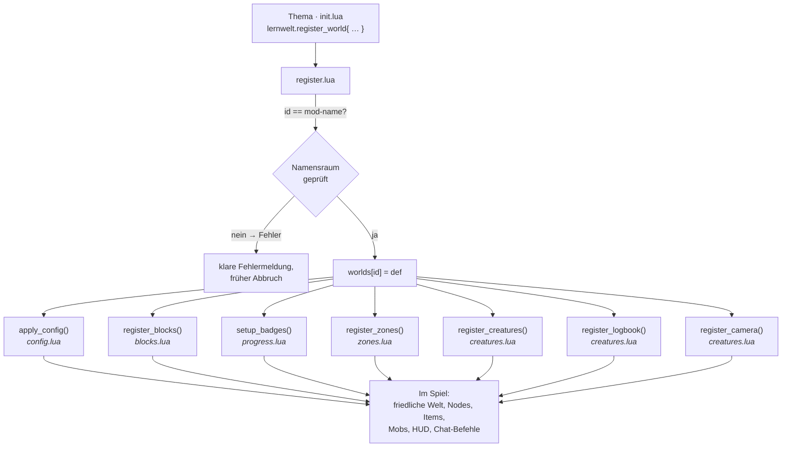
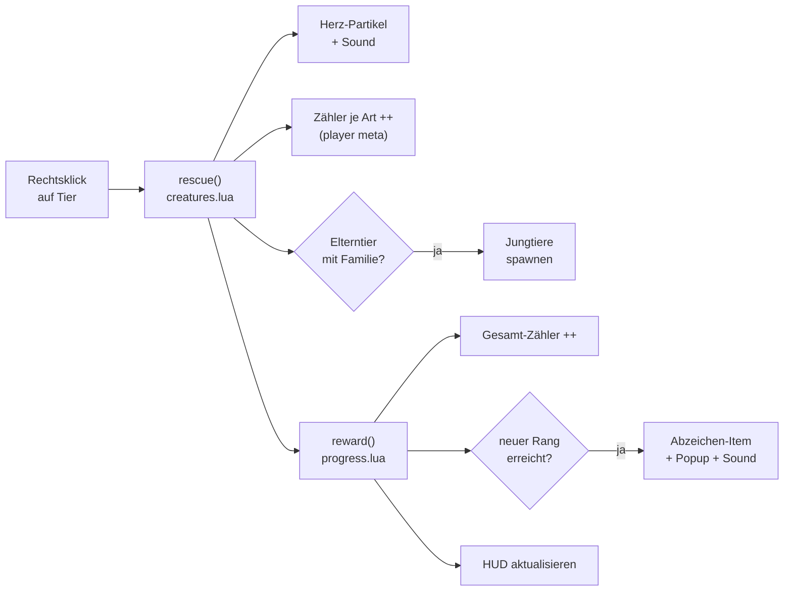
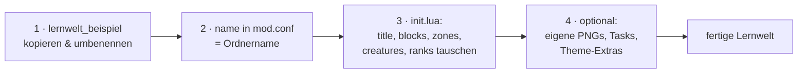

# Architektur & Themenwelten – Visualisierung

> Diese Seite erklärt **auf einen Blick**, wie das Lernwelt-Template aufgebaut
> ist und wie die mitgelieferten Themenwelten darauf aufsetzen. Gedacht für
> interessierte Entwickler:innen, die Aufbau und Mechanik schnell verstehen
> wollen.
>
> 🇬🇧 The codebase comments and the [README](../README.md) are in English; this
> visual guide is in German to match the example themes.

---

## Das große Bild

Drei Schichten: Die **Theme-Autor:in** schreibt nur eine deklarative Tabelle,
die **Engine** verdrahtet daraus alle Mechaniken, und im **Spiel** entstehen
Blöcke, Tiere, Tafeln und Fortschritt.


---

## Kernidee in einem Satz

Ein Thema ist **ein einziger `register_world{...}`-Aufruf** – kein weiteres Lua
nötig. Die Engine (`lernwelt`) liefert sämtliche Mechanik; Themen liefern nur
Namen, Farben, Zonen, Tiere und Lehrplan-Tags. Dadurch sind Themen
austauschbar, und Urheberrecht ist kein Thema: Die Engine ist themenneutral,
jedes Thema nutzt eigene Namen und Texturen.

```lua
lernwelt.register_world({
    title     = "Meine Welt",
    config    = { peaceful = true, freeze_time = "day" },
    blocks    = { { suffix = "pilz", color = "#e74c3c", glow = 7 } },
    zones     = { { id = "wiese", activity = "...", lehrplan = { "MA.2" }, tasks = { … } } },
    creatures = { { id = "schnecke", zone = "wiese" } },
    ranks     = { { 0, "Frischling" }, { 10, "Forscher", "#2ecc71" } },
    logbook   = { title = "Forscher-Logbuch" },
})
```

---

## Wie ein Thema geladen wird

`init.lua` der Engine lädt die Module in fester Reihenfolge; danach ruft jedes
Thema `register_world` auf, das wiederum jedes Modul verdrahtet.



---

## Die Module der Engine

| Modul | Aufgabe | Sichtbar im Spiel |
|---|---|---|
| `config.lua` | Friedliche Welt: kein Schaden, Tag eingefroren, keine Monster; sammelt empfohlene `minetest.conf`-Zeilen | `/lernwelt` |
| `lehrplan.lua` | Lehrplan-21-Tags (MA, D, NMG …); austauschbar gegen andere Curricula | `/lernplan` |
| `blocks.lua` | Bunte Blöcke aus Farbe (`[fill`) – ohne PNG; Glow, Glas, Muster, eigene Texturen | platzierbare Blöcke |
| `progress.lua` | Zähler, Ränge, HUD, Abzeichen-Items, zentrales `reward()` | HUD, `/lernfortschritt` |
| `mobs_adapter.lua` | Abstrahiert `mobs_redo` ↔ `mcl_mobs`; erkennt das Spiel automatisch | – (intern) |
| `creatures.lua` | Tiere, Rettung, Familien, Wasser-Spawner, Logbuch & Kamera | Tiere, Logbuch, Kamera |
| `zones.lua` | Lern-Tafeln (Nodes) mit Aktivität, Lehrplan und Aufgaben (Quiz/Muster/Rettung) + Teleport | Lern-Tafeln |
| `register.lua` | Der einzige Einstieg: prüft `id`, speichert die Welt und ruft alle Module auf | – (Orchestrierung) |

Lade-Reihenfolge (aus `init.lua`): `lehrplan → config → blocks → progress →
mobs_adapter → creatures → zones → register`. Reihenfolge zählt, weil
`register.lua` alle anderen Module benutzt.

---

## Die zentrale Schleife: Retten → Belohnen

Das Herz der Mechanik. Ein Rechtsklick auf ein Tier ruft `lernwelt.rescue` auf;
die Belohnung (`lernwelt.reward`) ist wiederverwendbar und wird auch von
gelösten Tafel-Aufgaben genutzt.



Dieselbe `reward()`-Funktion belohnt auch gelöste Aufgaben an den Lern-Tafeln
(Quiz, Muster, Rettungsziel) – siehe `zones.lua`.

---

## Was pro Spieler gespeichert wird

Aller Fortschritt liegt im **`player meta`**, je Welt in einem eigenen
Schlüssel-Namensraum (`lernwelt:<welt-id>:…`), sodass mehrere Welten parallel
ohne Konflikt funktionieren:

- `…:rescues` – Gesamtzahl geretteter Tiere (→ Rang, HUD)
- `…:rank` – aktuell erreichter Rang
- `…:c_<tier>` – Rettungen je Tierart (Logbuch)
- `…:seen_<tier>` – mit der Kamera „entdeckt" (Sammel-Loop)
- `…:tasks` – Anzahl gelöster Tafel-Aufgaben
- `…:task:<zone>:<n>` – einzelne Aufgabe gelöst (einmalig)

---

## Die Themenwelten

Die Themen nutzen dasselbe Gerüst, zeigen aber verschiedene Stufen – von der
minimalen Kopiervorlage bis zum voll ausgebauten Thema mit eigenem Extra-Code:

### 🍄 Gluehpilz-Wald (Vorlage) · `lernwelt_beispiel`

Das **minimale Referenz-Thema** – rein deklarativ, ohne jeglichen Extra-Code.
Die ideale Kopiervorlage für eine eigene Welt.

| | |
|---|---|
| Blöcke | 7 (Leuchtpilze in 5 Farben, Waldweg, Glas) |
| Zonen | 3 (Pilzdorf, Glüh-Höhle, Bach-Wiese) |
| Tiere | 6 (Schnecke, Marienkäfer, Glühkäfer, Fledermaus, Igel, Molch) |
| Ränge | 4 (davon 2 mit Abzeichen) |
| Besonderheit | rein deklarativ; Legacy-Aliase nach Umbenennung |

### 🍄 Gluehpilz-Wald (voll ausgebaut) · `lernwelt_gluehpilz`

Die **kuschelige Erstwelt** – sehr niederschwellig, gleicher Titel wie die Vorlage,
aber als komplettes Thema mit eigenem Theme-Code (im `lernwelt_gluehpilz:`-Namensraum).

| | |
|---|---|
| Blöcke | ~30 deklarativ (Gluehpilze, Moos/Waldboden/Pilzhaus, Muster-, Per-Face-Blöcke) + 26 Buchstaben (A–Z) + Müll & Setzling + Tag-Nacht-Pilze |
| Zonen | 3 (Pilzwald, Glüh-Höhle, Bach) – **mit Aufgaben** (Quiz, Farb-Muster, Rettungsziel) |
| Tiere | 14 (u. a. Igel, Glühwürmchen, Biber, Wassermaus; ein seltener Traum-Falter) |
| Ränge | 5 (davon 3 mit Abzeichen) |
| Theme-Extras (eigener Lua-Code) | **Tag-Nacht-Pilze** (kindgesteuerter Tag-Nacht-Wechsel), reitbarer **Leucht-Käfer**, **Startausrüstung**, Wald-aufräumen, Pilze pflanzen, Glüh-Sporen, Ambient-Sound, **Buchstaben-Blöcke**, Befehle (`/pilzwald_haus`, `/pilzwald_teststation`, `/pilzwald_muell`) |
| Lernidee | nach Farbe sortieren (MA.2), gross/klein vergleichen (MA.1/2), Tag-Nacht erleben (NMG.1) |

Eine vollständige Spieleranleitung liegt in
[`../lernwelt_gluehpilz/ANLEITUNG.md`](../lernwelt_gluehpilz/ANLEITUNG.md).

### 🌊 Tiefsee-Retter · `lernwelt_tiefsee`

Zeigt, wie ein Thema **eigene Mechanik obendrauf** baut, die die Engine nicht
abdeckt – alles im selben `lernwelt_tiefsee:`-Namensraum.

| | |
|---|---|
| Blöcke | 17 deklarativ (Korallen, Glas, Muster-, Per-Face-Blöcke) + 26 Buchstaben (A–Z) + Müll & Setzling |
| Zonen | 4 (Riff, Offenes Meer, Dunkle Tiefsee, Meeresboden) – **mit Aufgaben** (Quiz, Muster, Rettungsziel) |
| Tiere | 14 (u. a. Clownfisch, Blauwal, Krake, Seestern; ein seltener Goldener Wal) |
| Ränge | 5 (davon 3 mit Abzeichen) |
| Theme-Extras (eigener Lua-Code) | fahrbare **Tauchkapsel**, **Startausrüstung** beim ersten Join, **Meer-aufräumen**-Minispiel, **Korallen pflanzen**, Ambient-Sound, **Buchstaben-Blöcke**, Test-Befehle (`/tiefsee_teststation`, `/tiefsee_basis`, `/tiefsee_muell`) |

Eine vollständige Spieleranleitung liegt in
[`../lernwelt_tiefsee/ANLEITUNG.md`](../lernwelt_tiefsee/ANLEITUNG.md).

---

## Eigene Welt bauen – die Kurzfassung



> **Warum `id` = Mod-Name?** Jeder Block, jedes Item und jedes Tier wird im
> `<id>:`-Namensraum registriert, und Luanti erlaubt einem Mod nur seinen
> eigenen Namensraum. `register.lua` erzwingt das und bricht sonst früh mit
> einer klaren Meldung ab.

---

*Quelle der Diagramme: Engine-Module unter [`../lernwelt/api/`](../lernwelt/api/),
Themen in [`../lernwelt_beispiel/`](../lernwelt_beispiel/) und
[`../lernwelt_tiefsee/`](../lernwelt_tiefsee/).*
